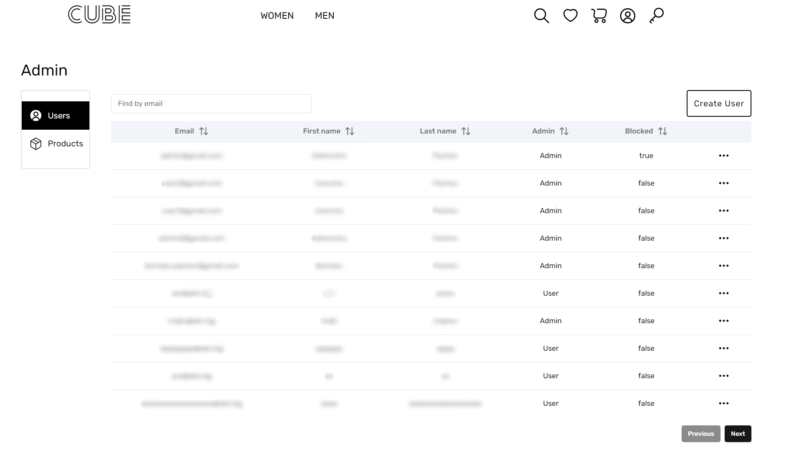

# Cube E-commerce Web App

A full-stack e-commerce application for selling customized t-shirts, with a modern and responsive UI, user authentication, and a secure backend API.

## Table of Contents

- [Cube E-commerce Web App](#cube-e-commerce-web-app)
  - [Table of Contents](#table-of-contents)
  - [About the Project](#about-the-project)
  - [Features](#features)
  - [Tech Stack](#tech-stack)
  - [Getting Started](#getting-started)
    - [Prerequisites](#prerequisites)
    - [Installation](#installation)
    - [Running the App](#running-the-app)
  - [API Endpoints](#api-endpoints)
  - [Project Structure](#project-structure)
  - [Screenshots](#screenshots)
    - [Home page](#home-page)
    - [Profile page](#profile-page)
    - [Admin page](#admin-page)
  - [Contact](#contact)

## About the Project

Cube E-commerce Web App is a full-stack web application designed for selling customized t-shirts in six unique categories, featuring personalized designs.

The project includes:

- Frontend: allows users to browse products, manage their profiles and favorite products, and make purchases.
- Backend: that handles user authentication, product management, and order processing.

## Features

- **Responsive UI**: Fully responsive design built with React and Tailwind CSS.
- **User Authentication**: Secure JWT-based login and signup functionality.
- **Product Management**: Browse products and select products by category.
- **Favorites & Cart**: Add/remove products from favorites and manage a shopping cart.
- **Dynamic Routes**: Navigate through different product categories with React Router.
- **Discount Countdown**: Limited-time promotions with a real-time countdown feature.
- **Backend API**: RESTful API for managing users, products, orders, and authentication.
- **Database Integration**: MongoDB for persistent data storage and retrieval.

## Tech Stack

- Frontend:
  - React (with Vite)
  - TypeScript
  - JWT Authentication
  - Tailwind CSS
  - React Router
  - ShadCN
- Backend:
  - Node.js
  - Express
  - MongoDB
  - Mongoose
  - JWT Authentication
  - Service-Oriented Architecture

## Getting Started

### Prerequisites

- Node.js (v16+)
- MongoDB

### Installation

Clone the repository:

```
git clone https://github.com/borislavpachev/cube-full-stack
```

Install dependencies for both frontend and backend.

```
cd client
npm install

cd server
npm install
```

### Running the App

Run the backend:

```
cd server
npm start
```

Run the frontend:

```
cd frontend
npm run dev
```

Visit http://localhost:5173/

## API Endpoints

`Authentication`

- POST /api/v1/users/login – Login with email and password
- POST /api/v1/users/signup – Sign up a new user with `user` role
- GET /api/v1/users/auth - Authenticate user and get JWT in a HTTP only cookie

`Users`

- GET /api/v1/users - Get all users
- POST /api/v1/users - Create a new user
- - GET / PATCH / DELETE /api/v1/users/:id - Retrieve / update / delete a user with specific ID

- PATCH /api/v1/users/block/:id - Block user with specific id
- PATCH /api/v1/users/unblock/:id - Unblock user with specific id

- PATCH / DELETE /api/v1/users/me - Update / Delete currently logged in user data
- PATCH /api/v1/users/me/update-password - Update currently logged in user password

`Products`

- GET /api/v1/products – Retrieve all products
- POST /api/v1/products - Create a new product
- GET /api/v1/products/:q – Retrieve products by category
- GET / PATCH / DELETE /api/v1/products/:id - Retrieve / update / delete a product with specific ID

`Cart`

- GET /api/v1/cart – Get cart
- PATCH / DELETE /api/v1/cart - Add / Remove an item to the cart

`Favorites`

- GET /api/v1/favorites – Get user's favorites list
- PATCH / DELETE /api/v1/favorites - Add / Remove an item to the user's favorites list

`Orders`

- GET /api/v1/orders - Get all user's orders
- PUT /api/v1/orders - Create a new order
- DELETE /api/v1/orders/:id - Delete an order

## Project Structure

```
├── client/
│ ├── public/
│ │ ├── categories/
│ │ ├── images/
│ ├── src/
│ │ ├── components/
│ │ ├── contexts/
│ │ ├── hooks/
│ │ ├── lib/
│ │ ├── pages/
│ │ ├── routes/
│ │ ├── services/
│ │ ├── utils/
│ │ └── App.tsx
├── server/
│ ├── config/
│ ├── controllers/
│ ├── models/
│ ├── routes/
│ ├── middleware/
│ ├── services/
│ ├── utils/
│ └── server.js
│ └── app.js
```

## Screenshots
### Home page


### Profile page


### Admin page



## Contact

- Name: Borislav Pachev
- Email: borislav.pachev@gmail.com
- [ LinkedIn ](https://www.linkedin.com/in/borislav-pachev)
